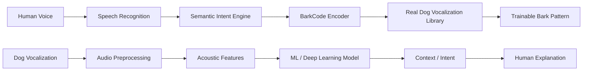

<div align="center">


<br>

---
---
---

### Human ↔ Dog Voice Communication Lab


<br>

[](https://www.python.org/)
[](https://fastapi.tiangolo.com/)
[](https://developer.mozilla.org/en-US/docs/Web/JavaScript)
[](https://icons.getbootstrap.com/)


</div>

---

## About DogTalk AI

**DogTalk AI** is an experimental voice-communication project that explores a two-way interface between humans and dogs.

Instead of treating every human sentence as a fixed number of identical barks, the current system detects **meaning and intent**, converts it into a project-defined **BarkCode**, and plays a repeatable sequence using real recorded dog vocalization.

```text
          HUMAN                                        DOG
            |                                            |
            v                                            v
     +--------------+                            +---------------+
     |   SPEECH     |                            | VOCALIZATION  |
     +------+-------+                            +-------+-------+
            |                                            |
            v                                            v
     +--------------+                            +---------------+
     |   INTENT     |        DOGTALK AI          | AUDIO FEATURES|
     |  DETECTION   | <------------------------> |   ANALYSIS    |
     +------+-------+                            +-------+-------+
            |                                            |
            v                                            v
     +--------------+                            +---------------+
     |  BARKCODE    |                            | HUMAN-READABLE|
     |   PATTERN    |                            | INTERPRETATION|
     +------+-------+                            +---------------+
            |
            v
     REAL DOG BARK AUDIO
```

> **Research note:** BarkCode is a project-defined, trainable association protocol. It is not a scientifically proven literal translation of human language into dog language. A dog would need training and repeated context to associate a BarkCode pattern with a desired meaning.

---

## Animated Interface

<div align="center">


</div>

The frontend includes a motion layer designed to make the application feel like a live AI communication console:

- Scroll-triggered content reveals
- Interactive 3D card tilt
- Magnetic button movement
- Cursor-following ambient glow on desktop
- Animated hero/orbit treatment
- Recording and analysis pulse states
- Animated audio-wave states
- Result-entry transitions
- Scroll progress indicator
- Animated flow connectors
- Responsive motion behavior
- `prefers-reduced-motion` accessibility support
- Bootstrap Icons instead of emoji/sticker UI controls

```text
IDLE             LISTENING            PROCESSING             READY
 |                   |                    |                    |
 v                   v                    v                    v
[ mic ]  ------>  [ ~~~~~ ]  ------>  [ AI CORE ]  ------> [ PLAY ]
                     ^                       |                   |
                     |                       v                   v
                 pulse/glow             BarkCode             real bark
```

---

## BarkCode Engine

<div align="center">


</div>

The backend recognizes many everyday intentions instead of only a small set of training commands.

| Human meaning | Example input | BarkCode |
|---|---|---:|
| Greeting | `Hello`, `Hi`, `Good morning` | `1-1` |
| Identity | `I am Amit`, `My name is...` | `2-1-2` |
| Yes | `Yes`, `Okay`, `Sure` | `1` |
| No | `No`, `Don't`, `Never` | `3-1` |
| Thanks | `Thank you` | `1-1-1` |
| Sorry | `I'm sorry` | `2-1` |
| Love | `I love you`, `I miss you` | `1-2-1-2` |
| Help | `Help me` | `3-2-3` |
| Food | `I'm hungry`, `Food`, `Treat` | `2-1-2` |
| Water | `Water`, `I'm thirsty` | `1-3-1` |
| Walk | `Let's go outside`, `Walk` | `2-2-1` |
| Play | `Let's play`, `Fetch`, `Ball` | `1-1-2-1` |
| Sleep | `Bedtime`, `Go to sleep` | `2-2` |
| Come | `Come here` | `2-1-2` |
| Sit | `Sit down` | `1-2` |
| Stay | `Stay`, `Wait` | `2-3` |
| Stop | `Stop`, `Leave it`, `Drop it` | `3-2-3` |
| Praise | `Good boy`, `Good girl` | `1-1-1` |
| Danger | `Watch out`, `Be careful` | `3-3-1-3` |
| Pain | `I'm hurt`, `It hurts` | `3-2-3-2` |
| Fear | `I'm scared` | `3-1-3` |
| Happy | `I'm happy`, `Excited` | `1-1-1-2` |
| Sad | `I'm sad`, `Lonely` | `2-3-2` |
| Home | `Go home`, `Inside` | `2-1-1` |
| Car | `Let's go in the car` | `1-2-2` |
| Bath | `Bath`, `Wash` | `3-1-2` |
| Vet | `Vet`, `Doctor`, `Clinic` | `2-3-2` |

Unknown language is not discarded. The system also falls back to broader categories such as **question**, **request**, **positive statement**, **negative statement**, and **general statement**.

---

## Sentence Composition

DogTalk can split a longer human message into multiple semantic units.

```text
"Hello, I am Amit Paul. Come here. Let's play."

          |
          v
+---------------------+
| Speech Recognition  |
+----------+----------+
           |
           v
+---------------------+
| Semantic Segments   |
+----------+----------+
           |
     +-----+------+---------+---------+
     |            |         |         |
     v            v         v         v
  HELLO       IDENTITY     COME      PLAY
   1-1         2-1-2      2-1-2    1-1-2-1
     |            |         |         |
     +------------+----+----+---------+
                       |
                       v
              REAL BARK SEQUENCE
```

The same BarkCode should remain stable for the same intent so it can be used as a repeatable training association.

---

## Dog → Human Mode

DogTalk also supports the reverse direction.

```text
DOG BARK / WHINE / VOCALIZATION
              |
              v
        Browser Recorder
              |
              v
       FastAPI / Local
        Audio Analysis
              |
      +-------+-------+
      |       |       |
      v       v       v
    Pitch   Energy   Bursts
      \       |       /
       \      |      /
        v     v     v
        Interpretation
              |
              v
       Human-readable text
              |
              v
       Spoken explanation
```

The prototype measures properties including estimated pitch, energy, duration and sound bursts to produce a cautious behavioral interpretation.

---

## Core Features

| Feature | Status | Description |
|---|:---:|---|
| Human → Dog | `LIVE` | Human speech is mapped to semantic BarkCode patterns. |
| Dog → Human | `LIVE` | Dog audio is analyzed into acoustic features and an interpretation. |
| Real bark playback | `LIVE` | Uses recorded dog vocalization rather than an oscillator-generated machine tone. |
| Multi-intent sentences | `LIVE` | Longer speech can produce composed BarkCode sequences. |
| Browser microphone | `LIVE` | MediaRecorder captures audio directly in supported browsers. |
| Speech recognition | `LIVE` | Browser speech recognition captures spoken sentences. |
| Local fallback | `LIVE` | Frontend has fallback behavior when the API cannot be reached. |
| Animated interface | `LIVE` | Motion, waves, glow, tilt, transitions and recording states. |
| ML dog classifier | `PLANNED` | Replace/extend heuristics with trained models and labeled datasets. |

---

## Technology Stack

<div align="center">


</div>

### Frontend

`HTML5` · `CSS3` · `Vanilla JavaScript` · `Bootstrap Icons` · `MediaRecorder API` · `Web Speech API` · `Web Audio API`

### Backend

`Python` · `FastAPI` · `Uvicorn` · `Pydantic` · `CORS`

### Audio foundation

`Librosa` · `NumPy` · acoustic feature extraction · rule-based semantic BarkCode engine

---

## Project Structure

```text
DogTalk-AI/
|
+-- backend/
|   +-- main.py                 # FastAPI + BarkCode intent engine
|   +-- audio_analyzer.py       # Dog audio feature analysis
|   +-- requirements.txt        # Python dependencies
|
+-- frontend/
|   +-- index.html              # Main communication interface
|   +-- style.css               # Responsive animated visual system
|   +-- app.js                  # Recording, speech, BarkCode and playback
|   +-- assets/                 # DogTalk visual assets
|
+-- uploads/
|   +-- .gitkeep
|
+-- .gitignore
+-- README.md
```

---

## Run Locally

### 1. Clone

```bash
git clone https://github.com/amitpaul2004/dogtalk-ai.git
cd dogtalk-ai
```

### 2. Backend

```bash
cd backend
python -m venv .venv
```

Windows:

```bash
.venv\Scripts\activate
```

macOS / Linux:

```bash
source .venv/bin/activate
```

Install and run:

```bash
pip install -r requirements.txt
uvicorn main:app --reload
```

API server: `http://127.0.0.1:8000`

Swagger docs: `http://127.0.0.1:8000/docs`

### 3. Frontend

Open another terminal:

```bash
cd frontend
python -m http.server 5501
```

Then visit `http://127.0.0.1:5501/index.html`.

---

## API

```text
GET /api/health
 |
 +--> backend health status

POST /api/dog-to-human
 |
 +--> dog audio
      |
      +--> acoustic analysis
           |
           +--> human-readable interpretation

POST /api/human-to-dog
 |
 +--> human sentence
      |
      +--> semantic intent
           |
           +--> BarkCode segment(s)
                |
                +--> real dog-bark playback
```

---

## Roadmap

<div align="center">


</div>

- [x] Responsive DogTalk interface
- [x] Advanced UI animations
- [x] Dog → Human prototype
- [x] Human → Dog voice capture
- [x] Real recorded bark playback
- [x] BarkCode semantic intent system
- [x] Multi-intent sentence processing
- [x] Common daily-life intent vocabulary
- [x] Generic question/request/statement fallbacks
- [x] Browser microphone integration
- [x] Bootstrap Icons UI
- [ ] Multiple real bark samples for richer BarkCode phonemes
- [ ] Per-dog BarkCode training profiles
- [ ] Training mode with reward/association sessions
- [ ] Real dog-audio dataset
- [ ] Labeled behavior/context dataset
- [ ] ML vocalization classifier
- [ ] Deep-learning audio embeddings
- [ ] Context from body posture and video
- [ ] BarkCode learning analytics
- [ ] Model evaluation and confidence calibration
- [ ] Production deployment

---

## Future AI Architecture



---

## Experimental Principle

```text
A random bark is not a language.

A consistent pattern
        +
repeatable meaning
        +
training and context
        =
BarkCode experiment
```

DogTalk AI should therefore be treated as an **experimental communication and training interface**, not as a claim that dogs naturally speak encoded human sentences.

---

## Contributing

Contributions are welcome.

```bash
git checkout -b feature/your-feature
git add .
git commit -m "feat: add your feature"
git push origin feature/your-feature
```

Then open a pull request describing what you changed and how it was tested.

---

## License

DogTalk AI is currently presented as an educational and experimental project. Add an explicit open-source license before redistribution or production use, and verify licenses for all external audio/assets used by the project.

---

<div align="center">


### DogTalk AI

**Experimental Human ↔ Dog Voice Communication Lab**

`BarkCode · Audio Intelligence · Voice Interaction · Animated UI`

</div>
