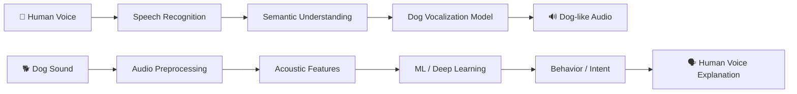

<div align="center">

# 🐶 DogTalk AI

### <i>Talk human. Hear dog.</i>

<p>
  <strong>🐾 Human ↔ Dog Voice Communication Lab</strong>
</p>


<br />

[](https://github.com/amitpaul2004/dogtalk-ai)
[](https://www.python.org/)
[](https://fastapi.tiangolo.com/)
[](https://developer.mozilla.org/en-US/docs/Web/JavaScript)

</div>

---

## ✨ What is DogTalk AI?

**DogTalk AI** is a coding-first experimental project exploring whether AI and audio analysis can create a useful communication bridge between humans and dogs.

The current prototype has two directions:

```text
                 🧠 DogTalk AI
                      │
          ┌───────────┴───────────┐
          ▼                       ▼
     🐕 DOG → HUMAN          🧑 HUMAN → DOG
          │                       │
     Bark / Whine / Growl     Human Speech
          │                       │
     Audio Analysis           Speech Recognition
          │                       │
     AI Interpretation        Meaning / Intent
          │                       │
     🗣️ Human Explanation    🐕 Dog-like Vocal Pattern
```

> ⚠️ **Important:** DogTalk AI is not a scientifically verified dog-language translator. Dog communication is complex and context-dependent. Current outputs are experimental interpretations and repeatable dog-like vocal patterns, not literal translations.

---

## 🎙️ Core Features

| Feature | Description |
|---|---|
| 🐕 **Dog → Human** | Records dog vocalizations and analyzes acoustic features. |
| 🧑 **Human → Dog** | Captures a complete human sentence and converts its meaning into a repeatable dog-like vocal pattern. |
| 🎤 **Voice Input** | Browser microphone recording for both directions. |
| 🔊 **Audio Output** | Plays generated dog-like vocal patterns and spoken interpretations. |
| 📊 **Audio Analysis** | Estimates pitch, energy, duration and vocal bursts. |
| 🧠 **AI-ready Architecture** | Designed to evolve from heuristics into trained ML/deep-learning models. |
| 🌑 **Modern UI** | Dark glassmorphism interface with animated waves, orbit effects and responsive cards. |
| 📱 **Responsive** | Designed for desktop and mobile screens. |

---

## ⚡ Animated Experience

The interface is designed as an interactive AI communication lab:

```text
       🎤 HUMAN VOICE
             │
             ▼
     ┌─────────────────┐
     │  ~ ~ ~ ~ ~ ~ ~  │  ← animated audio wave
     └────────┬────────┘
              │
              ▼
          🧠 AI CORE
              │
              ▼
     ┌─────────────────┐
     │ 🐕 BARK PATTERN │  ← generated vocal sequence
     └────────┬────────┘
              │
              ▼
          🔊 PLAY
```

The README itself also uses an animated typing header to showcase the project's communication concept.

---

## 🧩 Tech Stack

### Frontend

- HTML5
- CSS3
- Vanilla JavaScript
- Web Speech API
- MediaRecorder API
- Web Audio API
- Responsive / glassmorphism UI

### Backend

- Python
- FastAPI
- Uvicorn
- Pydantic
- CORS middleware

### Audio / ML foundation

- Librosa
- NumPy
- Acoustic feature extraction
- Prototype rule-based interpretation
- Future ML / deep-learning model integration

---

## 📁 Project Structure

```text
DogTalk-AI/
│
├── backend/
│   ├── main.py                 # FastAPI application
│   ├── audio_analyzer.py       # Dog audio feature analysis
│   └── requirements.txt        # Python dependencies
│
├── frontend/
│   ├── index.html              # Main UI
│   ├── style.css               # Animated visual system
│   ├── app.js                  # Voice + API interactions
│   └── assets/
│       └── dogtalk-logo.svg    # Logo + favicon asset
│
├── uploads/
│   └── .gitkeep
│
├── .gitignore
└── README.md
```

---

## 🚀 Run Locally

### 1. Clone the repository

```bash
git clone https://github.com/amitpaul2004/dogtalk-ai.git
cd dogtalk-ai
```

### 2. Start the FastAPI backend

```bash
cd backend
python -m venv .venv
```

**Windows:**

```bash
.venv\Scripts\activate
```

**macOS / Linux:**

```bash
source .venv/bin/activate
```

Install dependencies:

```bash
pip install -r requirements.txt
```

Start the API:

```bash
uvicorn main:app --reload
```

Backend:

```text
http://127.0.0.1:8000
```

API documentation:

```text
http://127.0.0.1:8000/docs
```

### 3. Start the frontend

Open a second terminal:

```bash
cd frontend
python -m http.server 5501
```

Open:

```text
http://127.0.0.1:5501/index.html
```

---

## 🔌 API Endpoints

```text
GET  /api/health
     └── Check backend status

POST /api/dog-to-human
     └── Analyze a dog audio recording

POST /api/human-to-dog
     └── Process a human voice/text command
```

---

## 🧪 Example

### Human → Dog

Human says:

> **"Hello, my name is Amit Paul. I am in JIS University. My age is 22."**

Prototype flow:

```text
Human Voice
     ↓
Speech Recognition
     ↓
Complete Sentence
     ↓
Meaning / Intent Encoding
     ↓
Dog-like Vocal Pattern
     ↓
🔊 Woof • Bark • Awooo • Bark • Woof
```

The output is an experimental vocal pattern representing the input rather than a claim that a dog would understand the literal human sentence.

---

## 🧠 Roadmap

- [x] Modern responsive UI
- [x] Dog → Human prototype
- [x] Human → Dog voice interaction
- [x] Browser microphone recording
- [x] Dog-like audio pattern generation
- [x] Animated visual interface
- [x] Logo + favicon
- [ ] Real dog-audio dataset
- [ ] Labeled dog behavior dataset
- [ ] ML-based dog vocalization classifier
- [ ] Deep-learning audio embeddings
- [ ] Context-aware multimodal model
- [ ] Real-time microphone analysis
- [ ] Better natural dog vocal synthesis
- [ ] Model evaluation and confidence calibration
- [ ] Cloud deployment

---

## 🔬 Future AI Architecture



---

## 🤝 Contributing

Contributions, ideas and experiments are welcome.

```bash
git checkout -b feature/your-feature
git add .
git commit -m "feat: add your feature"
git push origin feature/your-feature
```

Then open a Pull Request.

---

## 📜 License

This project is intended as an educational and experimental AI project. Add your preferred open-source license before distributing it publicly.

---

<div align="center">

### 🐾 Built to explore the question:

## <i>"What if humans and dogs could communicate through AI?"</i>

<br />

**DogTalk AI · Experimental Voice Communication Lab · v0.3**

</div>
